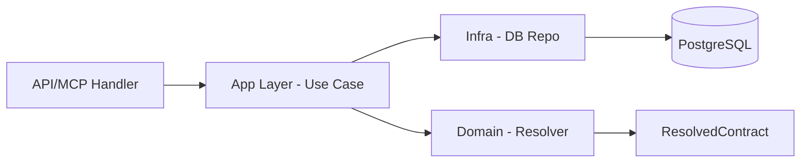

# Core Feature — The System Nucleus

Este directorio contiene el **motor central** de DevContext AI. Sigue una arquitectura disciplinada por capas para garantizar la predictibilidad y la gobernanza del contexto.

## 🧱 Arquitectura por Capas

El núcleo está dividido en tres capas principales con una jerarquía de dependencias estricta:

### 1. `domain` (La Verdad)

Contiene la lógica pura del sistema: el **Resolver**, los catálogos de reglas/comandos y las definiciones de tipos.

- **Regla de Oro**: Ninguna función en `domain` puede tener efectos secundarios (I/O, Red, DB).
- **Entregable**: Transforma una intención en un `ResolvedContract` determinístico.

### 2. `infra` (Los Adaptadores)

Responsable de la persistencia y la comunicación con servicios externos (Supabase, API Clients).

- **db/**: Repositorios CRUD puros. No contienen lógica de negocio.
- **Regla**: Solo esta capa conoce los detalles de la base de datos o el cliente de Supabase.

### 3. `app` (La Orquestación)

Contiene los casos de uso que coordinan `domain` e `infra`.

- **Inmutabilidad**: No muta objetos devueltos por el dominio. Siempre devuelve nuevos estados.
- **Responsabilidad**: Validación de ownership, registro de logs y ejecución de flujos (ej. `mcp-execute`).

---

## 🚫 Reglas de Cumplimiento (MANDATORIAS)

1. **Imports Relativos**: En este directorio `src/features/core/**`, solo se permiten imports relativos. El alias `@/` está prohibido para evitar acoplamientos circulares.
2. **Pureza del Dominio**:
   - Prohibido el uso de `Date`, `Math.random` o `process.env` dentro de `domain`.
   - Prohibido importar nada de `next`, `supabase` o `infra` desde `domain`.
3. **No Placeholders**: El código aquí debe estar 100% implementado. No se permiten `TODO`, `FIXME` o `...`.
4. **Validación de Ownership**: Todo caso de uso en `app` debe validar explícitamente que el usuario tiene acceso al recurso (`projectId`, `contextId`).

---

## 🧭 Flujo de Datos

> "El sistema define. El usuario elige. El resolver decide."
